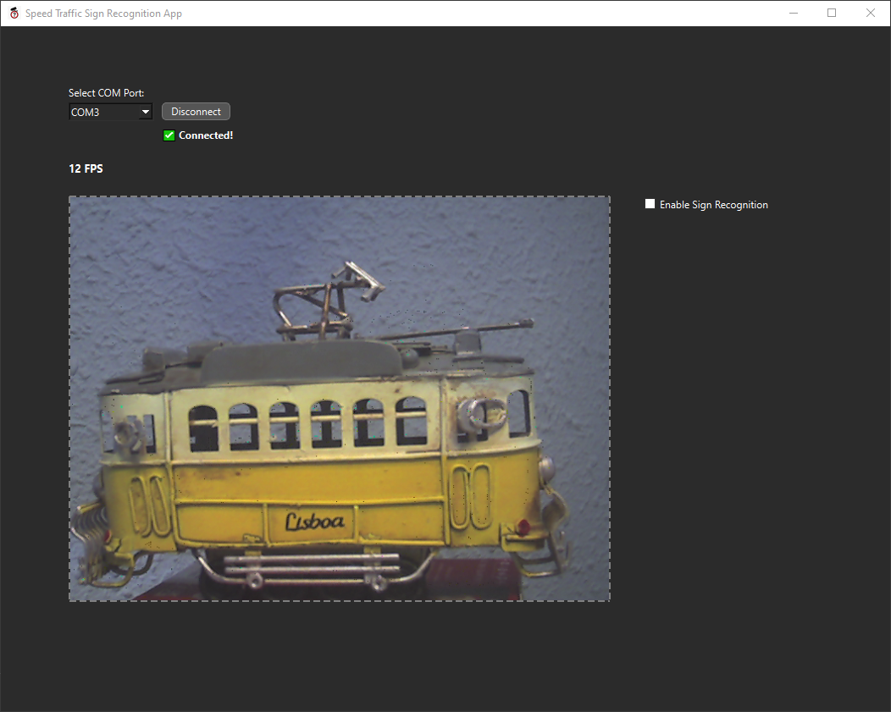
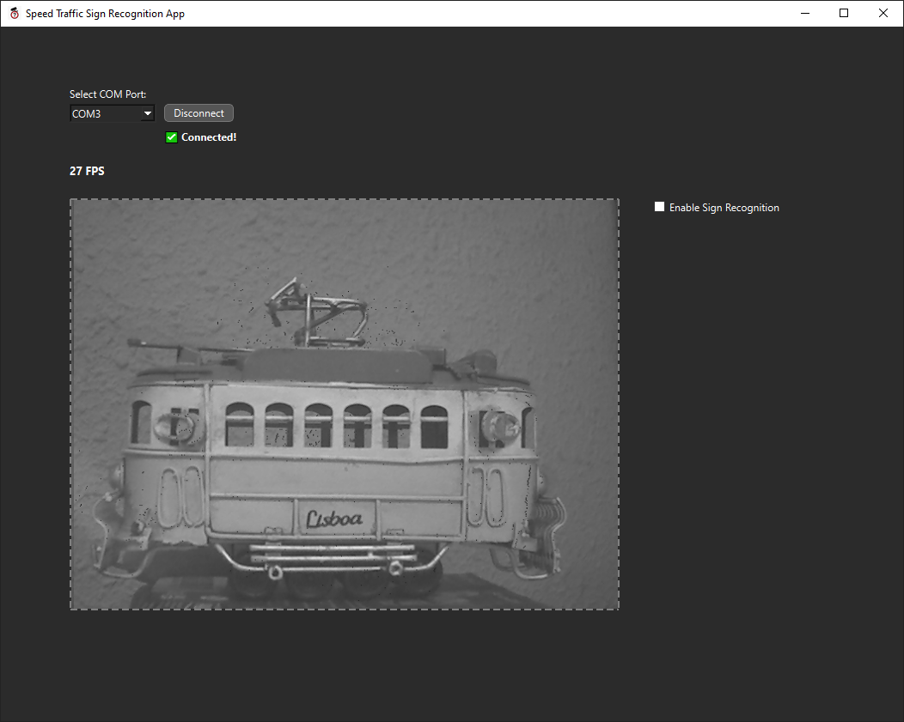

# 🧩 FPGA Modules

This folder contains the **hardware modules** implemented in VHDL for the project. They are designed to be reusable and modular, forming the core FPGA architecture. 

**📂 Folder structure**
```
FPGA_Modules/
├── CLOCKGEN/                            # CLOCK GENERATOR module files
│ └── simulation/                        # Simulation file (.tcl)
│
├── DISP7SEG/                            # DISPLAY 7 SEGMENTS module files
│ └── simulation/                        # Simulation file (.tcl)
|
├── FT245_TRANSCEIVER/                   # FT245 TRANSCEIVER module files
│ ├── IFREAD/                            # IFREAD submodule files
|   └── sim/                             # Simulation file (.tcl)
| └── IFWRITE/                           # IFWRITE module files
│   └── sim/                             # Simulation file (.tcl)
|
├── IMAGE_PIPELINE/                      # IMAGE PIPELINE module files
│ ├── FIFO/                              # FIFO submodule files
|   └── sim/                             # Simulation file (.tcl)
| ├── MT9V111_IF/                        # MT9V111 module files
│   └── sim/                             # Simulation file (.tcl)
| └── SENSOR_EMULATOR/                   # SENSOR_EMULATOR module files
│   └── sim/                             # Simulation file (.tcl)
|
├── TOP/                                 # TOP files
│ ├── FREE_RUNNING_COUNTER/              # FREE RUNNING COUNTER submodule files
| └── sim/                               # Simulation files (.tcl)
|
├── assets/                              # images, docs, etc
|
└── bitstreams/                          # Bitstreams files (.bin, .bit)
```

## Architecture overview

Below is a detailed block diagram representing the hardware implementation developed in VHDL. It shows the connections between the different logic blocks, as well as the
control signals and relevant data that enable the system to operate in real time.


### FT245 TRANSCEIVER

This functional block comprises the read (**IFREAD**) and write (**IFWRITE**) interfaces of the UM232H-B.

Both share an 8-bit bidirectional or inout (input/output) DATA bus, through which data is exchanged between the PC and the FPGA. The rest of the control signals are independent and are described below:
- **IFREAD**  
    This component is responsible for reading data from the UM-232H-B module when the PC sends information to the FPGA.
- **IFWRITE**  
This component manages the sending of data from the FPGA to the PC via the UM232H-B module. It controls when writing can take place and generates the write signal.

### CLOCKGEN

This component called **CLOCK GENERATOR** is responsible for generating the XCLK clock output, which will be the input for the MT9V111 SoC.

### DISP7SEG

This block implements control of the 4-digit 7-segment display incorporated in the BASYS 3.

### IMAGE PIPELINE

This functional block is responsible for acquiring real images captured by the MT9V111 image sensor or emulated from the SENSOR EMULATOR component. When received through the MT9V111_IF interface, they are stored in the form of bytes (in a FIFO), which
contain the pixel information before being sent to the PC through the FT245 TRANSCEIVER block.

- **FIFO**  
Reading the image from the sensor is faster than transmitting it to the PC, so it is necessary to implement FIFO RAM in the system, which allows the data received from the image sensor to be stored and ensures that it is
not lost and that there are no integrity issues with the data while it is being sent to the PC.

- **MT9V111_IF**  
This block acts as an interface with the MT9V111 sensor, as its name suggests. Its purpose is to receive image data from the sensor and transfer it to the system's FIFO, respecting the control signals and avoiding loss of
information.

- **SENSOR EMULATOR**    
This component has been developed to emulate the operation of the MT9V111 image sensor, allowing verification of the correct operation of the interface (MT9V111_IF), 
as well as the entire process of sending data to the PC without the need for real hardware, all through simulations.

---
#### FREE-RUNNING COUNTER  
This block is a simple counter with automatic reloading. It is a block designed for sending tests from the FPGA to the PC.

---

## 💾 Bitstreams

The folder [`bitstreams/`](bitstreams/) contains the FPGA configuration files (`.bit`, `.bin` ) generated after synthesis and implementation.  
These files can be directly programmed into the FPGA to test the different modules or the complete system.  

Two parameters define each bitstream:  
- **Clock frequency** of the image sensor interface: `12 MHz` or `25 MHz`  
- **Image format**: `COLOR` or `GRAY` (grayscale)

Available bitstreams:

 `TOP_12MHz_COLOR.bit` →  Sensor interface at 12 MHz, color output  
 `TOP_12MHz_COLOR.bin` →  Same configuration in `.bin` format   
 `TOP_25MHz_GRAY.bit`  →  Sensor interface at 25 MHz, grayscale output   
 `TOP_25MHz_GRAY.bin`  →  Same configuration in `.bin` format   

> ⚠️ Note: The bitstreams are provided for reference and testing purposes.  
> If you modify the VHDL sources, you will need to regenerate them using **Xilinx Vivado**.

## 📊 Performance Results

By using two of the provided bitstreams, the following frame rates were achieved when transmitting images from the FPGA to the application:

- **TOP_12MHz_COLOR** → up to **12–13 FPS** in color mode.
  
  
- **TOP_25MHz_GRAY** → up to **27 FPS** in color mode.
  

> The images are screenshots from the `SpeedTrafficSignRecognitionApp`, showing the received frames in real time.
> ⚠️ *Final decision:** The FPGA configuration is used in **color mode (TOP_12MHz_COLOR)**, since the neural network was trained with **color images** and cannot properly interpret grayscale inputs. 

