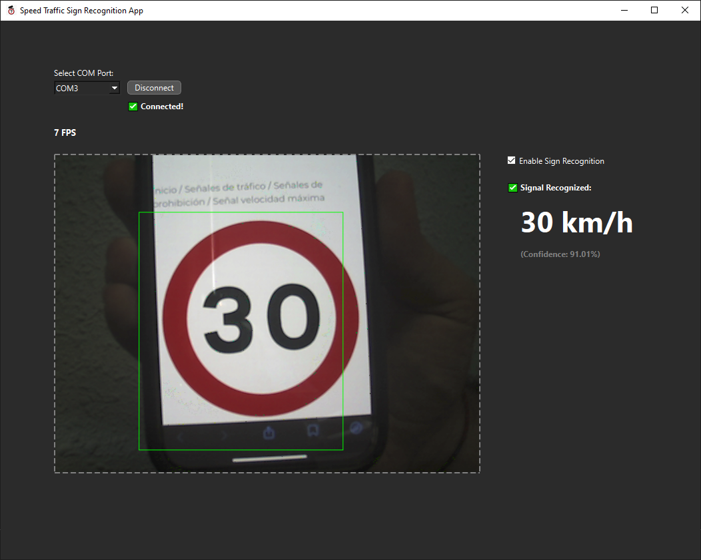
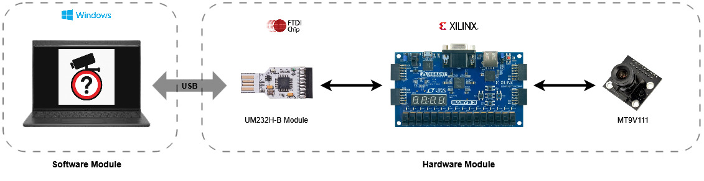

<table>
  <tr>
    <td></td>
    <td><h1>Speed Traffic Sign Recognition System</h1></td>
  </tr>
</table>

This project is focused on the **automatic detection and recognition of traffic signs related to speed limits**.  
It combines an FPGA-based hardware module for real-time image acquisition with a Python software application powered by a trained neural network for traffic sign recognition.  

The goal is to provide a modular and portable system that can be used for **vehicular environments, driving simulators, or academic research**, serving as a foundation for future integration into **Advanced Driver-Assistance Systems (ADAS)**. 



## Overview

The system consists of two main modules:
- **Hardware module**: acquires images using a digital sensor and transmits them to the software module.  
- **Software module**: receives the images, processes them using a neural model, and presents the results through a graphical user interface (GUI).  



The user can control the system directly from the application:
- Establish connection with the hardware.  
- View captured images.  
- Enable/disable traffic sign detection and recognition.  

Thanks to its **modular architecture** and portability, this system is suitable for **academic/testing purposes** as well as future integration into **ADAS (Advanced Driver-Assistance Systems)**.  

## 🔧 System Architecture

The system is composed of the following elements:
- 💻 A computer running Windows.  
- 🖥️ Desktop application **SpeedTrafficSignRecognitionApp**.  
- 🔌 **UM232H-B** FTDI module for USB communication.  
- 🎛️ **BASYS 3 development board** with Xilinx Artix-7 FPGA for image acquisition.  

---

## 💻 Software Module

The software is developed in **Python 3.11.11**, using:  
- **PySide6** for the GUI.  
- **Ultralytics YOLOv8** for traffic sign recognition (speed limits).  

The graphical interface allows the user to:  
- Establish a connection with the FPGA.  
- View captured images in real time.  
- Enable or disable traffic sign detection.  
- Display recognition results: detected class (speed limit) + confidence level.  

📌 For more information [README](https://github.com/ManuelSN/Speed_Traffic_Sign_Recognition_System/blob/main/Software/README.md). 

---

## ⚡ Hardware Module

The hardware is implemented on the **Artix-7 FPGA** (BASYS 3 board).  
Its main function is to **acquire images from the MT9V111 sensor** and transmit them to the PC through the **FT232H USB controller**.  

📌 For more information [README](https://github.com/ManuelSN/Speed_Traffic_Sign_Recognition_System/blob/main/Hardware/FPGA_Modules/README.md).  

---

## 📑 Documentation

A complete and detailed memory of the project (objectives, design decisions, tests, results) is available on my **LinkedIn profile**:  
👉 [Full Project Report on LinkedIn](www.linkedin.com/in/manuel-sanchez-natera-b0171519b)  

---

## 🚀 Quick Start

### 🖥️ Software

- **End users** → download and run the installer from [releases](https://github.com/ManuelSN/Speed_Traffic_Sign_Recognition_System/releases).  
  The application will install automatically — no Python or Conda required.  

- **Developers** → create the conda environment for software development with:  
  ```
  conda env create -f Software/conda_environment.yml
  conda activate SpeedTrafficSignRecognitionApp_env
  ```
Then run or modify any script from [`Software/`](https://github.com/ManuelSN/Speed_Traffic_Sign_Recognition_System/tree/main/Software).  
You can also retrain or fine-tune the YOLO model in the [`Neural_Network/`](https://github.com/ManuelSN/Speed_Traffic_Sign_Recognition_System/tree/main/Software/Neural_Network) folder if needed.  

---

### 🔧 Hardware

- **End users** → program the FPGA with one of the provided bitstreams from [`/bitstreams`](Hardware/FPGA_Modules/bitstreams).  
  Load the `.bit` or `.bin` file into the BASYS 3 board to use the desired configuration.  

- **Developers** → if you want to modify or extend the FPGA design:  
  - Edit the VHDL sources inside `Hardware/FPGA_Modules/`.  
  - Synthesize and implement the updated design using **Xilinx Vivado**.  
  - Generate the new bitstreams (`.bit` / `.bin`) and program them into the FPGA.  
